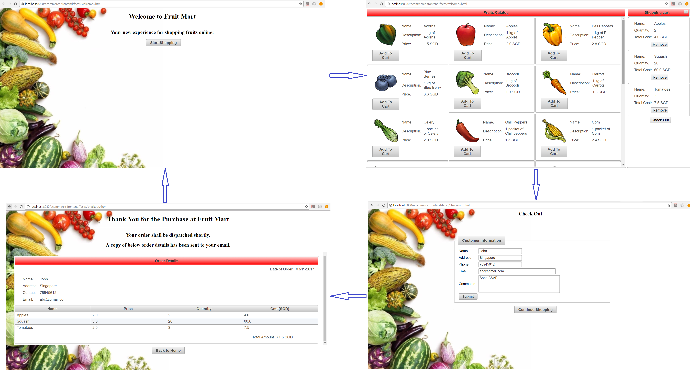

E-Commerce FrontEnd - FruitMart
-------------------------------

The E-Commerence FrontEnd application is developed using the **PrimeFaces** UI framework. The below diagram shows the screen flow the application.

  

__Prerequistes for running the application__
* Navigate to ***db_model*** directory in ***ecommerce_frontend*** project folder and run the ***fruimart_setup_dbsetup.sql*** script to create the database schema objects used by this application. (Project uses MySQL database) 
* Create ***JDBC Resource*** and ***Connection Pool*** in Payara server console in order to connect to the created schema. Make sure the name of the resources are same as that used in the ***persistence.xml***  
* Create the JMS ***ConnectionFactory*** and ***Destination*** resource in Payara server console in order to configure JMS Queue. Make sure the name of the resources is same as that used in ***CustomerView.java***.
* Configure the ***JavaMailSessions*** resource in the Payara server console in order to enable the email services. Make sure the name of the resources is same as that used in ***EmailSessionBean.java***. Refer to following screenshot for configuring the mail resources.

  

#### Features implemented in the application ####

1. The below diagram shows the ER diagram of the entities used for persistance in the application.

  

2. The Customer uses the shopping view to browse the fruit catalog and add desired items into the cart by providing quantity required. The customer can remove the selected item from the cart or can increase the quantity of the already selected item. 

3. Once the customer checks out then he/she will be taken to check out page where their personal details are to be submitted. If this customer's details is already stored in the database, then once the name field is filled the remaining fields are auto populated. After the all the details are provided and submitted, the customer is taken to thank you page where the placed order details are shown.

4. When the customer details are submitted, the order details are sent to the warehouse backend via the configured JMS queue and at the same time it is sent to the customer via email. 
