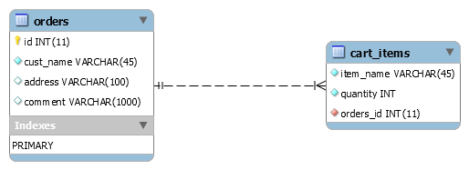

E-commerce Warehouse BackEnd
----------------------------

This application is built using the provided [project template](https://github.com/chukmunnlee/ejava2017_ca1). The template consists of the angular web front end and we were instructed to create backend components to populate the provided view.

__Prerequistes for running the application__
* Navigate to ***db_model*** directory in ***warehouse_backend*** project folder and run the ***warehouse_dbsetup.sql*** script to create the database schema objects used by this application. (Project uses MySQL database) 
* Create ***JDBC Resource*** and ***Connection Pool*** in Payara server console in order to connect to the created schema. Make sure the name of the resources are same as that used in the ***persistence.xml***  
* The JMS destination resource name used while configuring JMS queue (explained in e-commerce frontend readme) should match the ***mappedName*** attribute provided in the ***WarehouseBean.java*** MDB class.

Once the project is setup and ran in netbeans, the subsequent webpage launched will prompt user to provide the websocket url in order to connect to the backend. Use one of the following url -

> __ws://localhost:8080/warehouse/orders/__  
>As soon as a client connects using this url, the web page will start displaying the live order messages received from e-commerce front application from that moment on.

>__ws://localhost:8080/warehouse/orders/true__  
>As soon as a client connects using this url, the history of order messages stored in the database will also be displayed and from then on the live messages received will be displayed.

#### Features implemented in the application ####

1. The below diagram shows the ER diagram of the tables used for persistance in the application.

  

  
These two tables are used to store the incoming order details and are created to match the schema of received JSON object.

2. The incoming messages are read by the MDB(***WarehouseBean.java***) and sent to the websocket class (***WarehouseWS.java***) via injected Event class. The websocket class implements a method which uses the ***@Observes*** annotation to listen for the event fired from MDB - The event contains the received order messages. A application scoped session handler is created to store the created sessions and to make sure the event handling can access the connected sessions in order to broadcast the messages. 

3. The earlier mentioned two url schemes are used to provide an option to the user of either viewing the order history along with the incoming messages or to view only current messages.

Note: Since we were specifically instructed to not to touch the web app, the time stamp shown in the order history is of current timestamp. 

